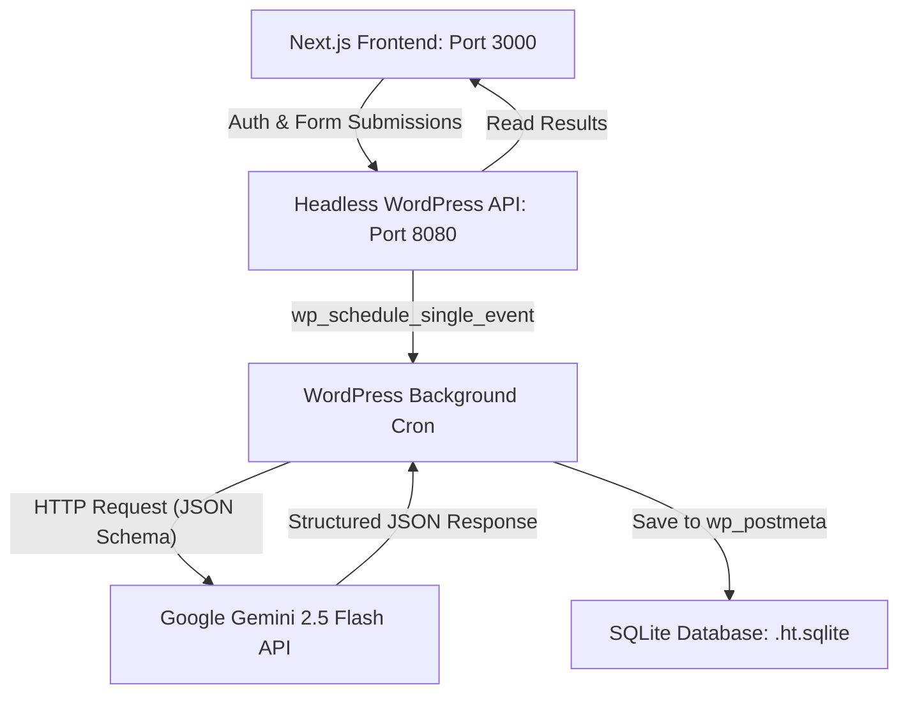

# Project Setu: Technical System & Architecture Summary (A to Z)

Project Setu is a high-performance, headless EdTech assessment platform designed to evaluate academic submissions, identify knowledge gaps, and generate customized practice materials. It utilizes a Next.js frontend and a headless WordPress backend powered by SQLite, integrating with Google's Gemini 2.5 Flash model for structure-constrained academic analysis.

---

## 🏛️ System Architecture Overview

The platform uses a decoupled, headless architecture:



- **Frontend:** Next.js (Page-based router) styled with Tailwind CSS, leveraging Lucide React for iconography and Framer Motion for premium micro-animations.
- **Backend:** WordPress serving as a headless content management system and API engine, running on a local PHP server backed by SQLite (removing the need for a heavy MySQL daemon).
- **Core Orchestrator:** The `setu-core` WordPress plugin, which exposes custom REST routes, implements HMAC authentication, manages custom post types (`setu_submission`), and triggers the background evaluation via WordPress Cron.

---

## 💻 Frontend Implementation (Next.js)

The frontend is built using Next.js, optimizing for fast page builds and a premium, responsive layout.

### Design System & Theme
- **Color Palette:** Warm Indigo brand palette. Neutral backgrounds utilize warm stone tones (`bg-warm-50`), avoiding sterile pure whites or harsh dark themes. Primary accents use a rich Indigo (`bg-brand-600` / `#4f46e5`).
- **Typography:** The layout uses the **Inter** font family, loaded via `@import` in Google Fonts.
- **Layout Shell:** A global `AppShell` component handles the dashboard grid, providing a unified sidebar navigation, user headers, responsive mobile drawer menus, and dynamic navigation state highlighting.

### Core Pages
1. **Landing Page (`/`):** A comprehensive introduction containing a Hero, a simulated dashboard preview card, a 3-step "How it Works" guide, a 9-part Capabilities grid, a side-by-side comparison chart, supported exam domains, a collapsible accordion FAQ, and a footer.
2. **Login & Registration Page (`/login`):** A professional, split-screen layout with a product presentation panel on the left, and a form on the right that toggles between Sign In and Sign Up (Create Account) modes.
3. **Dashboard Page (`/dashboard`):** Provides a visual summary of preparation progress with score cards, quick-link domain shortcuts, and a paginated table of past submissions showing real-time processing statuses.
4. **Analyze Page (`/analyze`):** A workspace where users select target exam domains (e.g., UPSC, GATE), paste their study notes or essays, track their word count, and submit for grading.
5. **Results Page (`/result/[id]`):** Displays the analysis breakdown, featuring:
   - An animated SVG gauge displaying the Readiness Score (0-100).
   - An evaluation critique summary.
   - Identified skill gaps.
   - An interactive, multiple-choice practice mock test generated specifically for the identified gaps.
6. **Settings Page (`/settings`):** Allows users to modify profile details, set a default assessment domain, and toggle notification settings.

---

## ⚙️ Backend & API Implementation (WordPress)

WordPress acts as a secure, local API service and structured data repository.

### SQLite Database Integration
Persistence is managed by the `sqlite-database-integration` plugin. All pages, custom post types, and user records are stored inside `wordpress/wp-content/database/.ht.sqlite`. This keeps the database lightweight and portable.

### Custom Post Type & Meta Storage
The `setu-core` plugin registers the custom post type `setu_submission` and its corresponding metadata keys:
- `eval_status`: (`pending` | `processing` | `completed` | `failed`)
- `target_exam`: Exam target (e.g., UPSC, GATE)
- `readiness_score`: Integer (0-100)
- `evaluation_summary`: Comprehensive text feedback
- `skill_gaps`: JSON array of identified gaps
- `mock_test`: JSON array of questions, options, and correct answers

### HMAC Authentication (Token-Based)
To authenticate headless requests securely without standard session cookies, `setu-core` implements an HMAC token system:
- **Token Format:** `Header.Payload.Signature` (JWT-like structure).
- **Generation:** Generates a base64-encoded payload containing `user_id` and an expiration timestamp, signed using `hash_hmac` with the `SECURE_AUTH_KEY` constant from `wp-config.php`.
- **Validation:** Checked via the `authorization` bearer header for all secure routes.

### API Endpoints
All routes are registered under the `setu/v1` namespace:
- **`POST /login`:** Authenticates credentials and returns the secure token.
- **`POST /register`:** Creates a new user account in SQLite and returns the secure token.
- **`POST /submit`:** Saves a new submission post, marks it `pending`, schedules a background cron event, and returns the post ID.
- **`GET /results`:** Returns a list of past submissions for the current authenticated user.
- **`GET /results/{id}`:** Fetches the full score, critique, gaps list, and mock test for a specific submission.

---

## 🤖 AI Assessment Engine (Google Gemini 2.5 Flash)

Submissions are evaluated using the Google Gemini 2.5 Flash API.

### Prompting & Schema Constraint
The model is instructed via `systemInstruction` to behave as an uncompromising academic grader for advanced examinations. To prevent formatting bugs or parser errors, Setu utilizes the **Gemini Structured Output API**, providing a strict JSON schema:

```json
{
  "type": "OBJECT",
  "properties": {
    "readiness_score": { "type": "INTEGER" },
    "evaluation_summary": { "type": "STRING" },
    "skill_gaps": {
      "type": "ARRAY",
      "items": { "type": "STRING" }
    },
    "mock_test": {
      "type": "ARRAY",
      "items": {
        "type": "OBJECT",
        "properties": {
          "question": { "type": "STRING" },
          "type": { "type": "STRING" },
          "options": {
            "type": "ARRAY",
            "items": { "type": "STRING" }
          },
          "correct_answer": { "type": "STRING" }
        },
        "required": ["question", "type", "options", "correct_answer"]
      }
    }
  },
  "required": ["readiness_score", "evaluation_summary", "skill_gaps", "mock_test"]
}
```

### Background Cron Processor
Because AI assessment can take 5-15 seconds, evaluations are run asynchronously.
1. When a user submits content, the API schedules a single event: `wp_schedule_single_event(time(), 'setu_process_submission_event', array($post_id))`.
2. It triggers `spawn_cron()` immediately to run the worker process without blocking the frontend response.
3. The background handler fetches the content, queries Gemini, parses the guaranteed schema-conforming JSON, writes the results to `wp_postmeta`, and sets `eval_status` to `completed`.

---

## 📝 Key Technical Insights & Solved Bottlenecks

1. **WP-Cron Scope Isolation:** Custom constants defined in `wp-config.php` (such as `GEMINI_API_KEY`) must be declared *before* `wp-settings.php` is required. Otherwise, independent cron spawns do not inherit the constant values, resulting in failed background evaluations.
2. **Tailwind CSS v4 Configuration:** When working with Tailwind v4 in Next.js, Google Fonts imports must precede the `@import "tailwindcss"` directive. Reversing this sequence triggers PostCSS syntax warnings and build issues.
3. **Framer Motion Type Definitions:** Animations inside React components using Framer Motion must define transition types strictly (e.g., using `ease: "easeOut" as const` instead of raw coordinate arrays) to avoid TypeScript compiler errors during Turbopack production builds.
4. **Next.js Type Caching:** The Next.js development compiler occasionally caches stale type definitions in `.next/dev/types/validator.ts`. This causes duplicate declaration compiler errors. The fix is to purge the `.next/` directory before rebuilding.
